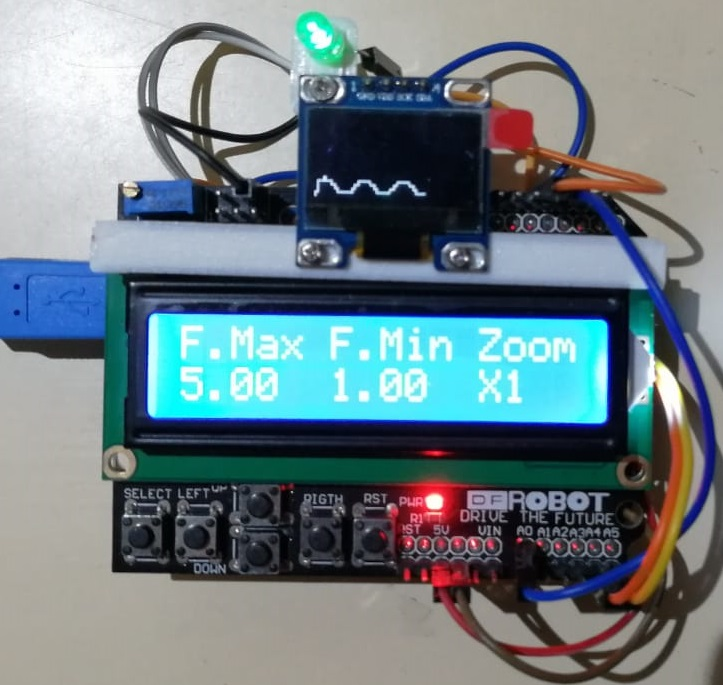
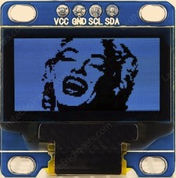
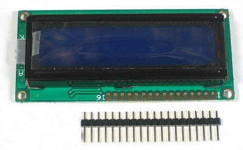
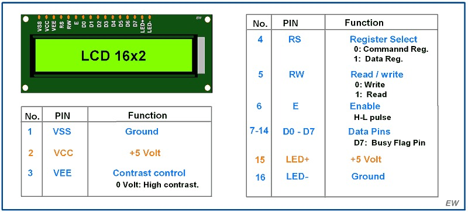
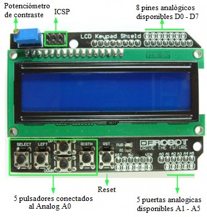
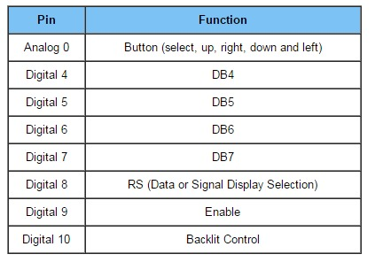
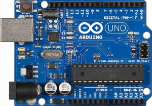

# CIU - Práctica 10

## Contenidos

* [Autoría](#autoría)
* [Introducción](#introducción)
* [Dependencias necesarias](#dependencias-necesarias)
* [Controles](#controles)
* [Implementación base](#implementación-base)
* [Implementación adicional](#implementación-adicional)
  * [Especificaciones del hardware](#especificaciones-del-hardware)
    * [OLED](#oled)
    * [LCD](#lcd)
    * [LCD Keypad shield](#lcd-keypad-shield)
    * [Arduino Uno](#arduino-uno)
  * [Desarrollo](#desarrollo)
* [Animación del programa](#animación-del-programa)

## Autoría

Esta obra es un trabajo realizado por Alberto Ramos Sánchez, Juan Sebastián Ramírez Artiles, Iru Nervey y Benearo Semidan Páez para la asignatura de Creación de Interfaces de Usuario cursada en la ULPGC.

## Introducción

El objetivo de esta práctica consiste en realizar el parpadeo de un LED con frecuencia variable.

Esta frecuencia estará entre un intervalo mínimo - máximo y su valor actual se halla según el valor del seno en ese instante de tiempo.

De manera opcional, usamos algunos componentes adicionales de hardware para editar la frecuencia máxima, el muestreo de la frecuencia calculada en el tiempo y un zoom ha dicha señal, junto con la visualización de los valores actuales de frecuencia mínima/máxima y zoom.

## Dependencias necesarias

Todas las dependencias aquí listadas se pueden obtener desde el IDE de Arduino.

* <b><Wire.h></b>: Permite conexión de dispositivos con el bus I2C.
* <b><LiquidCrystal.h></b>: Manejo de pantallas LCD.
* <b><Adafruit_GFX.h></b>: Manejo del OLED.
* <b><Adafruit_SSD1306.h></b>: Manejo del OLED.

## Controles

| Elemento | Resultado |
| -------- | --------- |
| Pulsador <br>LEFT | Suma 1 al zoom |
| Pulsador RIGTH | Resta 1 al zoom |
| Pulsador <br>UP | Suma FREQUENCY_FACTOR (En este caso es 0.5) a freqMax |
| Pulsador DOWN | Resta FREQUENCY_FACTOR (En este caso es 0.5) a freqMax |
| Pulsador <br>RST | Está conectado directamente al RESET de Arduino |
| Pulsador SELECT | No tiene uso |

## Implementación base

Como se indicó en la introducción, el algoritmo consiste en crear un parpadeo del LED interno de la placa Arduino Uno de modo que el periodo de cada parpadeo se vea dirigido por una función seno. Los valores devueltos por la función seno serán convenientemente mapeados a valores entre el rango de frecuencias mínimo y máximo.

La función seno tomara como parámetro la marca de tiempo en milisegundos del programa. La marca de tiempo será transformada matemáticamente para que el ciclo completo del seno dure doce segundos, antes de ser pasada como argumento al seno.

Para la implementación de esta funcionalidad hemos utilizado las variables <i>freqMax, freqMin, angle, periodMillis y timer</i>; además de una variable <i>didToobleBefore</i> que será la que se encargue de determinar si el pulso del parpadeo debe ser de subida o de bajada.

```c
float freqMax = 5.0f;
float freqMin = 1.0f;

float angle;
float frequency = freqMin;
unsigned int periodMillis = (1 / frequency) * 1000 / 2;
unsigned long timer = 0;

bool didToogleBefore = false;
```

La función que se encargará de producir el parpadeo se llama <i>toogleLedBuiltin</i>. Esta función leerá el estado del led interno, y si se encuentra en ciclo bajo lo pasará a alto y viceversa.

```c
void toogleLedBuiltin() {
  switch (digitalRead(LED_BUILTIN)) {
    case LOW:
      digitalWrite(LED_BUILTIN, HIGH);
      analogWrite(LED_BUILTIN_AUX, INTENSITY);
      break;
    case HIGH:
      digitalWrite(LED_BUILTIN, LOW);
      analogWrite(LED_BUILTIN_AUX, 0);
      break;
  }
}
```

Debido a que el LED integrado del Arduino queda oculto por el hardware adicional usado, también escribimos por un pin de manera analógica que tiene conectado otro LED.

La lógica que se encarga de calcular el semiperiodo y de llamar a esta última función se encuentra en el bucle principal del programa, y consiste en un testeo continuo del tiempo del programa restringido al tiempo del semiperiodo de modo que solamente se vuelva a llamar a la función <i>toogleLedBuiltin</i> y a calcular el nuevo semiperiodo una vez que se haya consumido el tiempo del semiperiodo anterior. Esta es una manera alternativa no-bloqueante para simular la función <i>delay</i>, con la cual, si bien se podía haber hecho, no es muy apropiada para estos casos.

```c
void loop() {
  unsigned long currentMillis = millis();

  oLedDisplay();

  if (currentMillis - timer >= periodMillis) {
    toogleLedBuiltin();
    if (didToogleBefore) {
      angle = currentMillis * 2.f * PI / WAVE_PERIOD;
      frequency = fmap(sin(angle), -1.0f, 1.0f, freqMin, freqMax);
      periodMillis = (1 / frequency) * 1000 / 2;
    }
    timer = currentMillis;
    didToogleBefore = !didToogleBefore;
  }
}
```

El ángulo que será pasado a la función seno se calculará en función del tiempo del programa y estará expresado en términos de PI de modo que sea fácilmente comprensible para el lector del código. Debido a que hemos asignado a las frecuencias los valores de 5Hz (Frecuencia máxima) y de 1Hz (Frecuencia mínima), nos hemos decantado por un periodo de 12 segundos para el del ciclo del seno (definido en <i>WAVE_PERIOD</i>), de modo que sea lo suficientemente prolongado para que el efecto del cambio de frecuencias del parpadeo fuera fácilmente perceptible.

Para el mapeo de los valores del seno a los valores de la frecuencia se hizo la función <i>fmap</i>, la cual toma como parámetros el valor actual del seno, los límites inferior y superior de la función seno, y los límites inferior y superior de la frecuencia de parpadeo, en nuestro caso particular. Se tuvo que hacer <i>fmap</i> debido a que el <i>map</i> solo retorna el tipo de dato int y requeriamos de float.

```c
float fmap(float s, float a1, float a2, float b1, float b2) {
  return b1 + (((s - a1) * (b2 - b1)) / (a2 - a1));
}
```

Esta función devolverá el valor de frecuencia correspondiente al valor del seno en el instante de la llamada. El valor de frecuencia obtenido se transformará a valor de periodo en segundos al ser invertido, y finalmente se pasará a milisegundos y se dividirá entre dos para que marque el tiempo que deberá tomar cada pulso del parpadeo.


## Implementación adicional

La implementación adicional permite cambiar la frecuencia máxima y el zoom de la señal. Para ello, usamos un <i>shield</i> que se compone de un LCD y una botonera, junto con un OLED adicional que fijamos sobre el LCD con ayuda de una pequeña pieza hecha en una impresora 3D, así como el LED auxiliar que imita el comportamiento del LED integrado.



### Especificaciones del hardware

#### OLED



* <b>Caracetrísticas</b>
  * <b>Estructura</b>: COG+PCB
  * <b>Tamaño</b>: 0.96 pulgada
  * <b>Matriz de punto</b>: 128 x 64 píxeles
  * <b>Controlador integrado</b>: SSD1306BZ
  * <b>Interfaz</b>: I2C

----

#### LCD




Para nuestro caso, solo usamos dos pines de control, RS y E, y los 4 pines de datos D7, D6, D5, y D4.

----

#### LCD Keypad shield




----

#### Arduino Uno



* <b>Caracetrísticas</b>
  * <b>Voltaje de operación</b>: 5V
  * <b>Voltaje de entrada (límites)</b>: 6-20V
  * <b>Pines de E/S digitales</b>: 14 (de los cuales 6 proporcionan salida PWM)
  * <b>Pines de entrada analógica</b>: 6
  * <b>Corriente DC por pin de E/S</b>: 40 mA
  * <b>Corriente DC para 3.3V Pin</b>: 50 mA
  * <b>Memoria Flash</b>: 32 KB de los cuales 0,5 KB utilizados por el bootloader
  * <b>SRAM</b>: 2 KB (ATmega328)
  * <b>EEPROM</b>: 1 KB (ATmega328) Velocidad de reloj: 16 MHz

### Desarrollo

En primer lugar, tenemos la inicialización de todos los elementos. Para el pin conectado a los botones, le hacemos una asiganación de interrupción. Con esto, evitaremos realizar <i>polling</i> del estado de los botones.

```c
void setup() {
  if (oled.begin(SSD1306_SWITCHCAPVCC, 0x3C)) {
    isOLedAvailable = true;
    oled.clearDisplay();
  }

  lcd.begin(LCD_WIDTH, LCD_HEIGHT);
  lcdDisplay();

  pinMode(LED_BUILTIN, OUTPUT);
  pinMode(LED_BUILTIN_AUX, OUTPUT);

  pinMode(INTERRUPTION_PIN, INPUT_PULLUP);
  attachInterrupt(digitalPinToInterrupt(INTERRUPTION_PIN), onButtonPressed, CHANGE);
}
```

Un detalle importante del <i>shield</i> y sus botones, es que retornan valores analógicos, por lo que disponemos de un enum con los rangos que emiten cada botón.

```c
enum Buttons {
  SELECT = 750,
  LEFT = 550,
  RIGHT = 50,
  UP = 150,
  DOWN = 350
};
```

A continuación, comentaremos como realizamos la impresión de datos tanto con el OLED con el LCD.

Para el OLED, usamos la anterior Y y calculamos la nueva mediante un mapeo con el rango mínimo/máximo de la frecuencia y la altura del OLED (a la inversa, ya que el punto (0,0) se sitúa arriba a la izquierda).

Con ambas Y, y un margen de 0.5 entre los puntos, creamos una línea. Si x alcanza el ancho del OLED, limpiamos y continuamos dibujando desde la izquierda.

En cuanto al LCD, simplemente escribimos en ambas filas los valores que queremos mostrar.

```c
void oLedDisplay() {
  int y = map(frequency, MIN_FREQUENCY_LOWER, MAX_FREQUENCY_UPPER, SCREEN_HEIGHT - PADDING, PADDING);

  oled.drawLine(x, previousY, x + X_INC, y, COLOR);

  previousY = y;
  x += zoom / ZOOM_FACTOR;

  if (x >= SCREEN_WIDTH) {
    x = START_X;
    oled.clearDisplay();
  }

  oled.display();
}

void lcdDisplay() {
  lcd.clear();
  lcd.setCursor(0, 0);
  lcd.print("F.Max F.Min Zoom");
  lcd.setCursor(0, 1);
  lcd.print(freqMax);
  lcd.print("  ");
  lcd.print(freqMin);
  lcd.print("  X");
  lcd.print(zoom);
}
```

Finalmente, tenemos la función a la que se llama cuando se produce una interrupción. Esta se encarga de revisar entre que valores se encuentra el pin de los botones, modificar el valor adecuado y resetear el valor del botón (poniendo a 1024 su valor, que implica que NO se pulsó).

Tras eso, refresca los valores del LCD, para una vez más, no hacerlo mediante <i>polling</i>.

```c
void onButtonPressed() {
  pinMode(BUTTONS_PIN, OUTPUT);
  int pressedButton = analogRead(BUTTONS_PIN);

  if (pressedButton <= SELECT && pressedButton > LEFT) {

  }
  if (pressedButton <= LEFT && pressedButton > DOWN) {
    pinMode(BUTTONS_PIN, INPUT_PULLUP);
    analogWrite(BUTTONS_PIN, 1024);
    zoom = min(zoom + 1, MAX_ZOOM);
    lcdDisplay();
    return;
  }
  if (pressedButton <= DOWN && pressedButton > UP) {
    pinMode(BUTTONS_PIN, INPUT_PULLUP);
    analogWrite(BUTTONS_PIN, 1024);
    freqMax = max(max(freqMax - FREQUENCY_FACTOR, MAX_FREQUENCY_LOWER), freqMin + FREQUENCY_FACTOR);
    lcdDisplay();
    return;
  }
  if (pressedButton <= UP && pressedButton > RIGHT) {
    pinMode(BUTTONS_PIN, INPUT_PULLUP);
    analogWrite(BUTTONS_PIN, 1024);
    freqMax = max(min(freqMax + FREQUENCY_FACTOR, MAX_FREQUENCY_UPPER), freqMin + FREQUENCY_FACTOR);
    lcdDisplay();
    return;
  }
  if (pressedButton <= RIGHT) {
    pinMode(BUTTONS_PIN, INPUT_PULLUP);
    analogWrite(BUTTONS_PIN, 1024);
    zoom = max(zoom - 1, MIN_ZOOM);
    lcdDisplay();
  }
}
```

## Animación del programa


